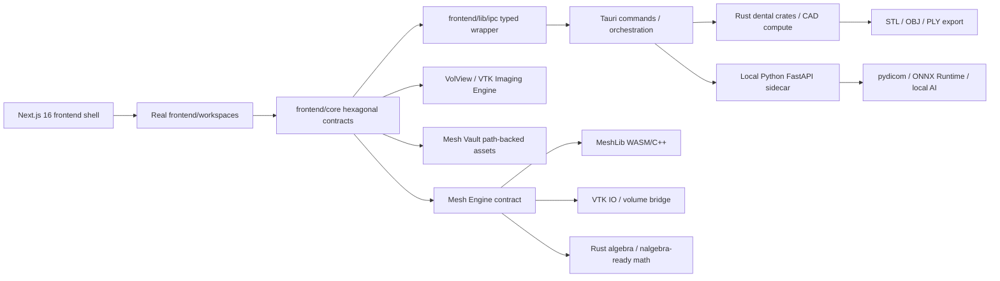

# TlantiCAD Integrated Architecture

## Target Runtime

## Module Boundaries

- `frontend`: active Next.js desktop webview contract, build root and recovery gate.
- `frontend/app`: Next App Router entrypoint for the Tauri webview.
- `frontend/App.tsx`: client-only workspace orchestrator for preloader, TlantiDB and CAD.
- `frontend/core`: domain, ports, use-cases and adapters.
- `frontend/workspaces/tlanti-cad/features/dicom-viewer`, `frontend/io`, `frontend/composables`, `Tauri/backend/python/trame_slicer_sidecar.py`: Tlanti Imaging Engine.
- `frontend/core/adapters/meshlib-vtk-algebra-engine.ts`: backend selection for MeshLib, VTK and Rust algebra without exposing raw buffers to React.
- `frontend/core/domain/mesh-engine.ts`: active UI/domain contract for mesh backends and local URI normalization.
- `frontend/workspaces/tlanti-cad`: CAD workstation and clinical panels.
- `frontend/workspaces/tlanti-db`: case management and launch context.
- `Tauri/src`: source Rust workspace and dental commands.
- `Tauri/backend`: offline Python DICOM/AI sidecar.

## Design Patterns Applied

- Facade: `frontend/App.tsx` exposes a single clinical workstation while preserving existing engines.
- Adapter: the DICOM clinical workspace, trame-slicer sidecar and `TauriMeshVault` adapt source modules into core ports.
- Command: Tauri commands remain the desktop boundary.
- Strategy: imaging, CAD, AI and export engines can evolve independently behind ports.
- Observer: Mesh Vault progress stays event-driven for long imports.

## Superior Alternative Implemented

The architecture is not a minimal shell. It is a modular workstation contract:

`Import -> Clean -> Segment -> Design -> Validate -> Export`

Heavy operations go Rust/Python. React coordinates state, previews and panels. trame-slicer/VTK handles medical imaging. Mesh Vault owns heavy file ingress.

## Next + Tauri + FastAPI Wiring

- Next serves the active webview at `http://127.0.0.1:1420` in development and exports to `frontend/out` for Tauri packaging.
- Tauri keeps `frontendDist` pointed at `../frontend/out` and exposes `local_backend_endpoint` so React does not hardcode Python sidecar paths.
- FastAPI allows only local development/Tauri origins and exposes the health route consumed by `LocalRuntimeBridge`.
- Browser-incompatible Node modules from medical codecs are blocked with webpack fallbacks (`fs`, `path`, `crypto`) so Cornerstone can stay in the client graph without trying Node IO.
